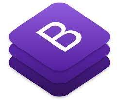

<h1> Hi there, I'm Alok Jha 👋</h1>

## I'm a Front-End developer
- 🔭 I’m currently working on something cool 😄
- 🌱 I’m currently learning React.js, Node.js
- 👯 I’m looking to collaborate on ...
- 🤔 I’m looking for opportunity in Front-End Development
- 💬 Ask me about HTML5/CSS3/Javascript/Bootstrap4
- ⚡ Fun fact:I love to Travelling and Watching Cricket

### Connect with me:

 

### Languages and Tools:

